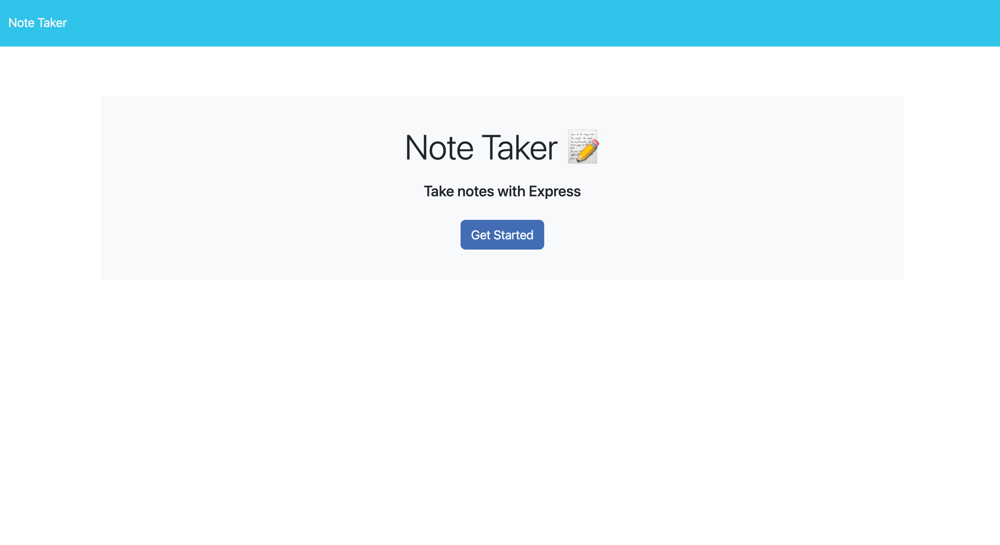
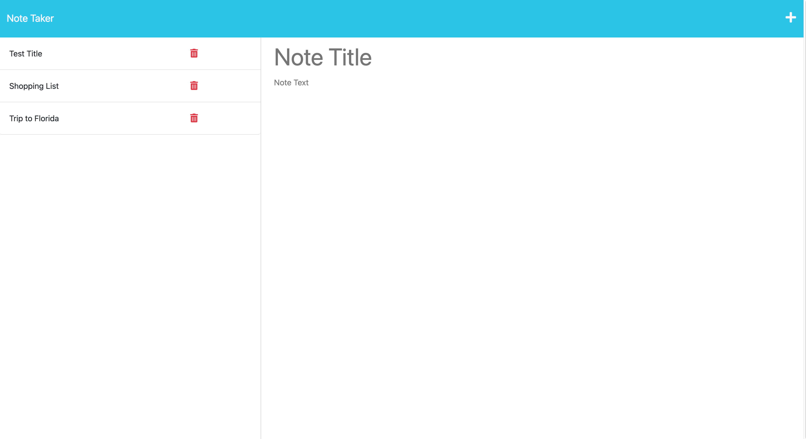
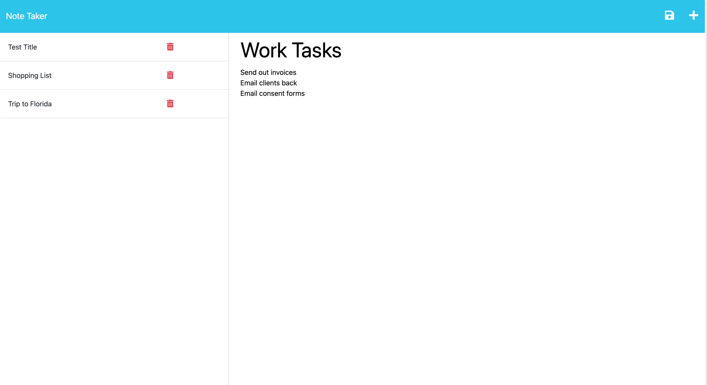

# Note_Taker

## Description
This is an application that can be used to write and save notes. This application will use an Express.js back end and will save and retrieve note data from a JSON file.

## Table of Contents
- [Installation](#installation)
- [Usage](#usage)
- [Credits](#credits)
- [License](#license)

## Installation
To install this project clone the code from the GitHub repository to your local system. Once you have cloned succesfully, open the integrated terminal in your server.js file and run nmp i then you will run npm start

## Usage
* To view this application deployed on Heroku use the following link: https://app-note.herokuapp.com
* To access this application in github use the following link:

## Application Screenshot

## Credits
* Starter code from Coding Boot Camp gitlab.
* Coursework from Coding Boot Camp module 11 referenced for additional guidance.

## License
This repository is licensed under the [MIT license](https://choosealicense.com/licenses/mit/).

---

## Badges

## How to Contribute
  To suggest an idea or report a bug, please create an issue. Or, submit a pull request from your fork to the original repository for review.

## Tests
To run test run npm test in the command line

